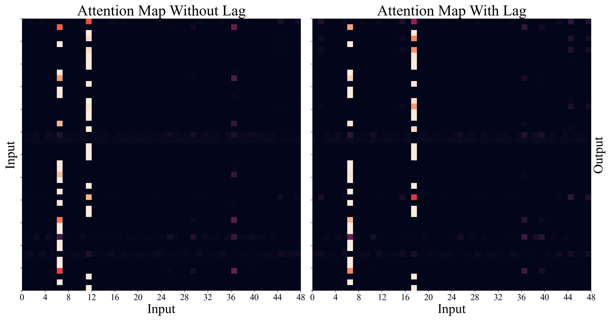
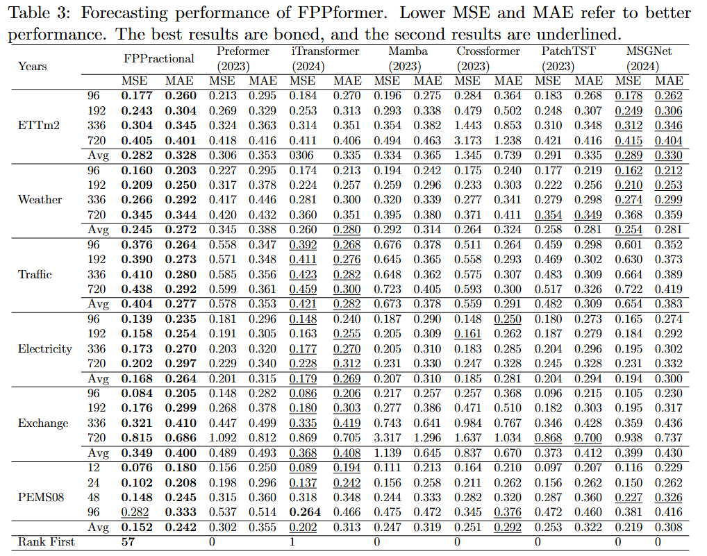

# FPPformer
This is an open-source project for deep learning researchers, especially for time series forecasting. The repo will release in the future.
We provide a detailed code project to evaluate advanced deep time series models long-term forecasting.

FPPformer:  Fractional Position With Predictive Attention for Multivariate Time Series Forecasting
Chengli Zhou, Yanhong Li, et.al.
Paper: https://ieeexplore.ieee.org/document/10976564/

## Introduction
🌟 Considering the time lag effect between the forecasting output and the input in time series forecasting, FPPformer proposes a new predictive attention to achieve goal. **A predictive attention for time series forecasting.**

<p align="center">

</p>


## Usage

1. Install Python 3.8 or later. For convenience, execute the following command.

```
pip install -r requirements.txt
```

2. Prepare Data. You can obtain the all datasets from folder `./data` .


3. Train and evaluate model. We provide the experiment scripts for all benchmarks under the folder `./scripts/`. You can reproduce the experiment results as the following examples:

```
# long-term forecast
bash ./scripts/ETT_script/FPPformer_ETTm2.sh
bash ./scripts/ECL_script/FPPformer_ECL.sh
bash ./scripts/Exchange_script/FPPformer_Exchange.sh
bash ./scripts/PEMS_script/FPPformer_PEMS.sh
bash ./scripts/Traffic_script/FPPformer_Traffic.sh
bash ./scripts/Weather_script/FPPformer_WTH.sh
```

4. Develop your own model.

- Add the model file to the folder `./models`. You can follow the `./models/FPPformer.py`.
- Include the newly added model in the `Exp_Basic.model_dict` of  `./exp/exp_basic.py`.
- Create the corresponding scripts under the folder `./scripts`.


## Contact
If you have any questions or suggestions, feel free to contact:

- Chengli Zhou (chenglizhou@mail.ynu.edu.cn)
- Chunna Zhao (zhaochunna@ynu.edu.cn)

Or describe it in Issues.

## Comparison Results for Input length L = 96
PFformer outperforms six other state-of-the-art models with just consider one state lag.

<p align="center">

</p>


